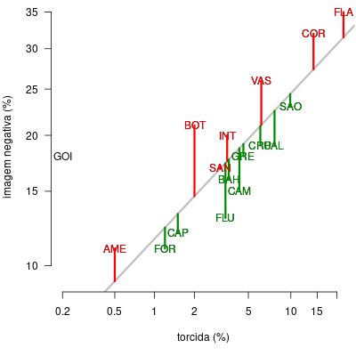
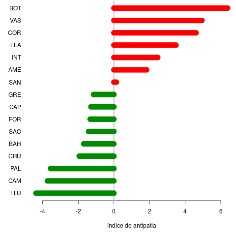

# Antipatia por clubes de futebol brasileiros

## Introdução

Este repositório contém parte dos dados da pesquisa AtlasIntel sobre as torcidas de clubes de futebol do Brasil, publicada pelo GloboEsporte em abril de 2023, assim que o programa em R para análise dos mesmos.

Os dados foram retirados de duas matérias, a [primeira](https://ge.globo.com/futebol/noticia/2023/04/25/maiores-torcidas-do-brasil-pesquisa-atlas-mostra-flamengo-corinthians-e-sao-paulo-no-top-3.ghtml) sobre o tamanho das torcidas e a [segunda](https://ge.globo.com/futebol/noticia/2023/04/26/pesquisa-atlas-palmeiras-e-o-clube-com-imagem-mais-positiva-do-pais-e-flamengo-tem-a-mais-negativa.ghtml) sobre a imagem dos clubes.

## Análise

A pesquisa da Atlas foi feita entre 6 e 20 de abril, via Internet utilizando a técnica de Recrutamento Digital Randômico, desenvolvido pelo AtlasIntel, que permite uma representação robusta da população alvo (pessoas que se interessam por futebol e consultam a Internet). Foram recolhidas 1.600 respostas em 640 municípios em todo o país.

Os resultados da pesquisa são coerentes com pesquisas anteriores e confirmam a supremacia dos clubes do Sudeste brasileiro, acompanhado do Grêmio de Porto Alegre. O questionário da AtlasIntel continha a pergunta “Você tem uma imagem positiva ou negativa desses times?”. A resposta podia ser positiva, negativa ou neutra. Na [matéria](https://ge.globo.com/futebol/noticia/2023/04/26/pesquisa-atlas-palmeiras-e-o-clube-com-imagem-mais-positiva-do-pais-e-flamengo-tem-a-mais-negativa.ghtml) do GloboEsporte, os times são ordenados em termos de porcentagem de respostas positivas, com Palmeiras, Fluminense e Athletico liderando o ranking. Entretanto, é interessante observar como a porcentagem de respostas negativas se relacionam com o tamanho das torcidas, como indicado no gráfico abaixo:

Neste gráfico são representados os times da Série A (que são mencionados em ambas matérias do GloboEsporte), Deste modo, Bragantino Red Bull, Coritiba e Cuiabá não estão presentes. Note também que as escalas horizontais e verticais não são lineares. Uma transformação [logit](https://pt.wikipedia.org/wiki/Logit) foi utilizada, que permite a transformação de porcentagens (limitadas entre 0% e 100%) numa escala que vai de menos infinito a mais infinito. Esta transformação é mais adequada para o processamento estatístico dos dados. Os dados utilizados para produzir o gráfico acima estão no arquivo [atlasintel-2023.csv](atlasintel-2023.csv).

[Note que as abreviações de Cruzeiro (CRU) e Palmeiras (PAL) estão parcialmente sobrepostas, dificultando a leitura.]

Pode-se observar que deve existir uma forte correlação positiva entre estas duas variáveis. É notável também a posição do Goiás, um time de torcida pequena (0.2%) mas com forte imagem negativa (18%). Nas análises subsequentes, o clube Goiás foi suprimido das análises, por se tratar de um ponto fora da curva.

A reta de regressão entre as duas variáveis (após transformação por logit) é mostrada abaixo:

A coeficiente de correlação entre o tamanho da torcida e a porcentagem de imagem negativa é de 0.87 (intervalo de confiança de 95% [0.65, 0.95]). Este valor é significativamente diferente de zero (_t_[14] = 6.46, _p_ < 0.001).

Pode-se assim dizer que o tamanho da torcida de um clube é um bom preditor da porcentagem de imagem negativa do mesmo. Em outras palavras, clubes de forte apelo popular também atraem a antipatia de uma grande parte dos outros torcedores e não é anormal que Flamengo (35%) e Corinthians (32%) sejam os clubes mais “odiados”.

Uma outra maneira de se medir a “antipatia” de um clube seria pela diferença entre a porcentagem de imagem negativa e o valor predito pela reta de regressão mostrada acima. Se um clube se situa acima desta reta, ele possui uma antipatia em excesso com respeito ao que se poderia prever pelo tamanho da sua torcida, e vice-versa. Esta diferença está indicada no gráfico abaixo, pelos segmentos de reta verticais, onde clubes com “excesso de antipatia” estão indicados em vermelho e clubes com “excesso de simpatia” estão indicados em verde:

Por fim, o gráfico abaixo fornece um ranking dos clubes, ordenados pelo “índice de antipatia” proposto acima. Times “simpáticos” estão em verde e times “antipáticos” em vermelho.

### Código para esta análise

O código que permite obter os resultados relatados acima, assim como os gráficos, se encontra no arquivo [analise.r](analise.r), escrito na linguagem de programação [R](https://www.r-project.org/).

## Author

Copyright © 2023  Rafael Laboissière (<rafael@laboissiere.net>)

O material contido neste repositório pode ser livremente distribuído e reproduzido de acordo com os termos da licença [Creative Commons Attribution 4.0 International (CC BY 4.0)](https://creativecommons.org/licenses/by/4.0/).

<!---
Local Variables:
ispell-local-dictionary: "brasileiro"
eval: (auto-fill-mode -1)
eval: (visual-line-mode)
eval: (flyspell-mode)
End:

LocalWords:  AtlasIntel GloboEsporte Athletico Red Bull Laboissière
 -->
